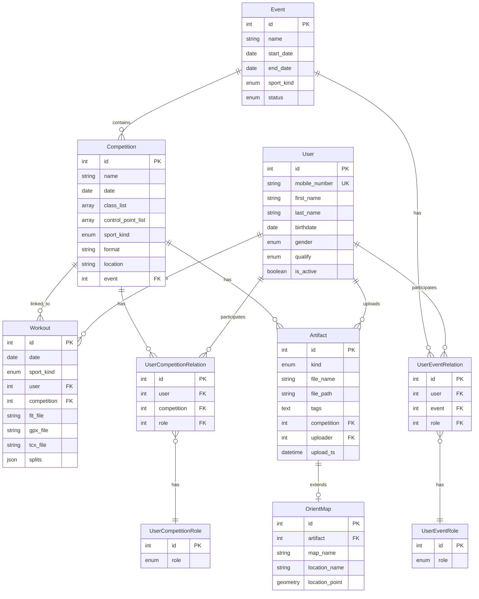

# Split Backend

Backend API for orienteering competition analysis platform. Enables athletes to track workouts, compare split times, and analyze performance across competitions.

## Features

- **Split Comparison** - Compare split times between two athletes on the same course
- **Workout Tracking** - Record training sessions with GPS/FIT/TCX data
- **Competition Management** - Organize events with multiple competitions, control points, and classes
- **Artifact Storage** - Store and serve orienteering maps (O-Maps) and GPS files via MinIO
- **User Roles** - Support for athletes, judges, and organizers with role-based access

## Tech Stack

- **Framework**: FastAPI
- **Database**: PostgreSQL 15 + PostGIS (geospatial)
- **ORM**: SQLAlchemy 2.0
- **Object Storage**: MinIO
- **Validation**: Pydantic 2.x
- **Migrations**: Alembic

## Entity Relationship Diagram



## Getting Started

### Prerequisites

- Python 3.11+
- Docker & Docker Compose
- Poetry

### Setup

```bash
# Clone repository
git clone https://github.com/pavel-zverkov/split_backend.git
cd split_backend

# Start infrastructure
docker-compose -f docker/docker-compose.yaml up -d

# Install dependencies
cd packages/backend
poetry install

# Run migrations
alembic upgrade head

# Start development server
uvicorn src.app:app --reload
```

### Environment Variables

Configure in `packages/backend/.env`:

| Variable | Description | Default |
|----------|-------------|---------|
| `POSTGRES_HOST` | PostgreSQL host | localhost |
| `POSTGRES_PORT` | PostgreSQL port | 5432 |
| `POSTGRES_DB` | Database name | split_db |
| `POSTGRES_USER` | Database user | split_pg_user |
| `POSTGRES_PASSWORD` | Database password | split_pg_pswd |
| `MINIO_HOST` | MinIO host | localhost |
| `MINIO_PORT` | MinIO API port | 9000 |
| `ACCESS_KEY` | MinIO access key | split_minio_user |
| `SECRET_KEY` | MinIO secret key | split_minio_pswd |
| `LOG_LEVEL` | Logging level | DEBUG |

## API Documentation

Once running, access interactive API docs:

- Swagger UI: http://localhost:8000/docs
- ReDoc: http://localhost:8000/redoc

## Project Structure

```
split_backend/
├── docker/
│   └── docker-compose.yaml
├── packages/
│   ├── backend/
│   │   ├── src/
│   │   │   ├── app.py              # FastAPI application
│   │   │   ├── config.py           # Environment configuration
│   │   │   ├── user/               # User management
│   │   │   ├── workout/            # Workout tracking
│   │   │   ├── competition/        # Competition management
│   │   │   ├── event/              # Event organization
│   │   │   ├── split_comparer/     # Split time analysis
│   │   │   ├── artifact/           # File storage (O-Maps, GPS)
│   │   │   ├── relations/          # User-Competition/Event relations
│   │   │   ├── roles/              # Role definitions
│   │   │   └── database/           # SQLAlchemy & MinIO setup
│   │   ├── migrations/             # Alembic migrations
│   │   └── pyproject.toml          # Dependencies
│   └── frontend/
│       ├── html/                   # Jinja2 templates
│       ├── css/                    # Stylesheets
│       └── java_script/            # JavaScript
└── CLAUDE.md
```

## License

MIT
