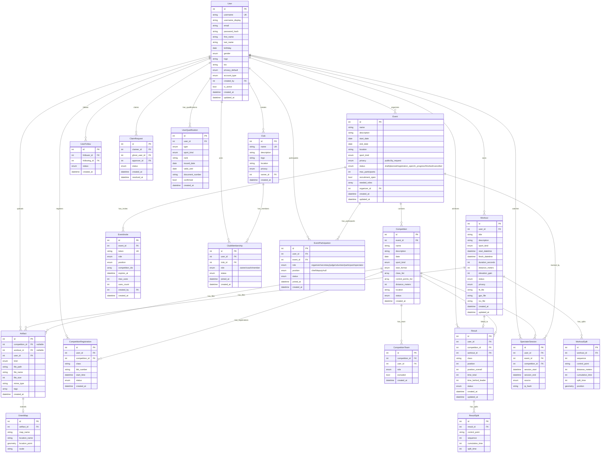

# Entity Relationship Diagram

## Entity Types Legend

| Type | Entities | Description |
|------|----------|-------------|
| **Core** | User, Club, Event, Competition, Workout, Artifact | Main business entities |
| **Relation** | UserFollow, ClaimRequest, ClubMembership, EventParticipation, EventInvite, CompetitionTeam, CompetitionRegistration | Junction tables (many-to-many) |
| **Child** | WorkoutSplit, ResultSplit, Result, OrientMap, UserQualification, SpectatorSession | Dependent on parent entity |

