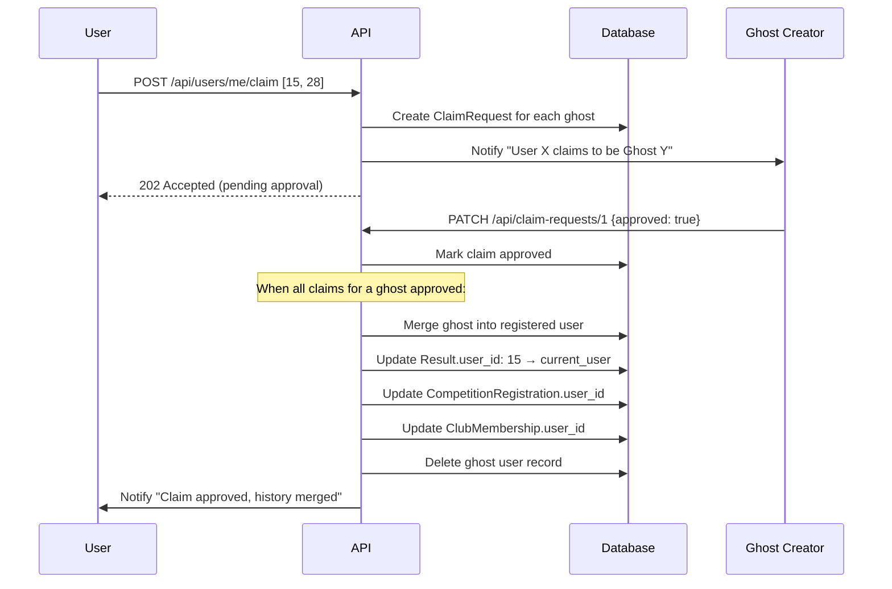
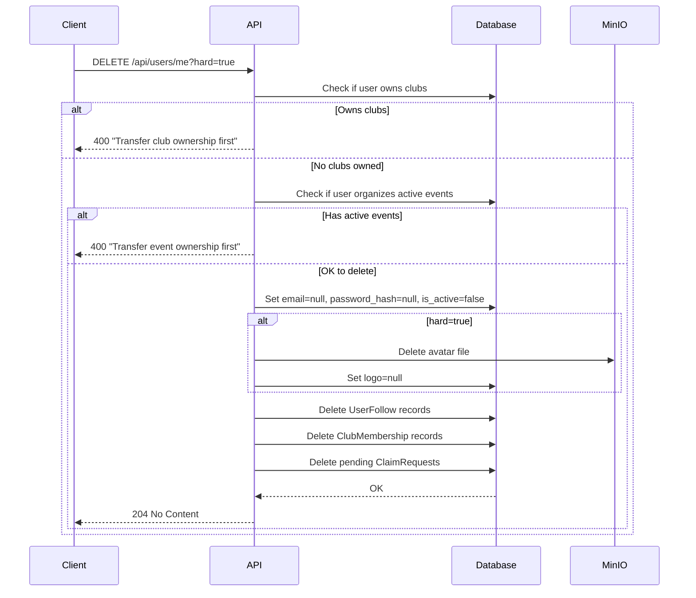

# 1. User Management

| # | Endpoint | Method | Description |
|---|----------|--------|-------------|
| 1.1 | `/api/auth/register` | POST | Register new account |
| 1.2 | `/api/auth/login` | POST | Login (username or email) |
| 1.3 | `/api/auth/refresh` | POST | Refresh JWT token |
| 1.4 | `/api/auth/logout` | POST | Logout (blacklist token) |
| 1.5 | `/api/users/me/password` | PATCH | Change password |
| 1.6 | `/api/users/me` | GET | Get current user profile |
| 1.7 | `/api/users/me` | PATCH | Update profile |
| 1.8 | `/api/users/me/avatar` | POST | Upload avatar |
| 1.9 | `/api/users/{user_id}` | GET | Get public profile |
| 1.10 | `/api/users` | GET | Search users |
| 1.11 | `/api/users/ghost` | POST | Create ghost user |
| 1.12 | `/api/users/me/find-history` | GET | Find matching ghost users |
| 1.13 | `/api/users/me/claim` | POST | Claim ghost users |
| 1.14 | `/api/claim-requests/{id}` | PATCH | Approve/reject claim |
| 1.15 | `/api/users/me/claim-requests` | GET | Get my claim requests |
| 1.16 | `/api/claim-requests/pending` | GET | Get claims to approve |
| 1.17 | `/api/users/me` | DELETE | Delete account |

## 1.1 User Registration

**Endpoint:** `POST /api/auth/register`

**Request:**
```json
{
  "username": "ivan_petrov",
  "password": "securepassword",
  "first_name": "Ivan",
  "last_name": "Petrov",
  "email": "user@example.com"
}
```

**Flow:**
1. Validate username uniqueness and format (alphanumeric + underscore)
2. Validate password strength (min 8 chars)
3. Hash password (bcrypt)
4. Create User with `account_type=registered`, `is_active=true`
5. Set `username_display = username`
6. Return user data + tokens

**Response:** `201 Created`
```json
{
  "user": {
    "id": 1,
    "username": "ivan_petrov",
    "first_name": "Ivan",
    "account_type": "registered"
  },
  "access_token": "eyJhbG...",
  "refresh_token": "eyJhbG...",
  "token_type": "bearer",
  "suggested_ghosts": []
}
```

**Note:** After registration, user is prompted to find their competition history (see 1.16).

## 1.2 Login

**Endpoint:** `POST /api/auth/login`

**Request:**
```json
{
  "login": "ivan_petrov",
  "password": "securepassword"
}
```

**Note:** `login` field accepts username OR email (if set).

**Flow:**
1. Find user by username or email
2. Check `account_type=registered` (ghost users can't login)
3. Verify password hash
4. Check `is_active=true`
5. Generate access token (JWT, 15min expiry)
6. Generate refresh token (JWT, 7 days expiry)
7. Return tokens

**Response:** `200 OK`
```json
{
  "user": {
    "id": 1,
    "username": "ivan_petrov",
    "first_name": "Ivan",
    "account_type": "registered"
  },
  "access_token": "eyJhbG...",
  "refresh_token": "eyJhbG...",
  "token_type": "bearer"
}
```

**Errors:**
- `401` - Invalid credentials or ghost user
- `403` - Account deactivated (`is_active=false`)

## 1.3 Refresh Token

**Endpoint:** `POST /api/auth/refresh`

**Request:**
```json
{
  "refresh_token": "eyJhbG..."
}
```

**Flow:**
1. Validate refresh token signature and expiry
2. Check user still active
3. Generate new access token
4. Optionally rotate refresh token

**Response:** `200 OK`
```json
{
  "access_token": "eyJhbG...",
  "refresh_token": "eyJhbG...",
  "token_type": "bearer"
}
```

## 1.4 Logout

**Endpoint:** `POST /api/auth/logout`

**Authorization:** Bearer token

**Request:**
```json
{
  "refresh_token": "eyJhbG..."
}
```

**Flow:**
1. Add refresh token to blacklist (Redis/DB)
2. Client discards access token

**Response:** `204 No Content`

## 1.5 Change Password

**Endpoint:** `PATCH /api/users/me/password`

**Authorization:** Bearer token

**Request:**
```json
{
  "current_password": "oldpassword",
  "new_password": "newpassword"
}
```

**Flow:**
1. Verify current password
2. Hash new password
3. Update user
4. Optionally invalidate other sessions

**Response:** `200 OK`

## 1.6 Get Current User

**Endpoint:** `GET /api/users/me`

**Authorization:** Bearer token

**Response:** `200 OK`
```json
{
  "id": 1,
  "username": "ivan_petrov",
  "username_display": "ivan_petrov",
  "email": "user@example.com",
  "first_name": "Ivan",
  "last_name": "Petrov",
  "birthday": "1990-05-15",
  "gender": "male",
  "logo": "https://minio.../avatars/1.jpg",
  "bio": "Orienteering enthusiast",
  "privacy_default": "followers",
  "account_type": "registered",
  "created_at": "2024-01-15T10:00:00Z"
}
```

## 1.7 Update Profile

**Endpoint:** `PATCH /api/users/me`

**Authorization:** Bearer token

**Request:**
```json
{
  "first_name": "Ivan",
  "last_name": "Petrov",
  "birthday": "1990-05-15",
  "gender": "male",
  "bio": "Orienteering enthusiast",
  "privacy_default": "public",
  "email": "newemail@example.com"
}
```

**Updatable fields:** `first_name`, `last_name`, `birthday`, `gender`, `bio`, `privacy_default`, `email`

**Response:** `200 OK` (updated user object)

## 1.8 Upload Avatar

**Endpoint:** `POST /api/users/me/avatar`

**Authorization:** Bearer token

**Request:** `multipart/form-data`
```
file: <binary image>
```

**Flow:**
1. Validate image (type, size < 5MB)
2. Resize/optimize
3. Upload to MinIO: `avatars/{user_id}.jpg`
4. Update user.logo

**Response:** `200 OK`
```json
{
  "logo": "https://minio.../avatars/1.jpg"
}
```

## 1.9 Get Public Profile

**Endpoint:** `GET /api/users/{user_id}`

**Authorization:** Optional (more data if authenticated)

**Response:** `200 OK`
```json
{
  "id": 5,
  "username_display": "petr_sidorov",
  "first_name": "Petr",
  "last_name": "S.",
  "logo": "https://minio.../avatars/5.jpg",
  "bio": "Trail runner",
  "account_type": "registered",
  "follow_status": "accepted",
  "followers_count": 120,
  "following_count": 85,
  "workouts_count": 234
}
```

**Note:** `last_name` truncated for privacy. Full name visible to followers.

**`follow_status` values** (requires authentication, otherwise `null`):
| Value | Meaning | UI Element |
|-------|---------|------------|
| `null` | Not authenticated or not following | "Follow" button |
| `pending` | Request sent, awaiting approval | "Requested" (disabled) |
| `rejected` | Rejected (masked as pending) | "Requested" (disabled) |
| `accepted` | Currently following | "Unfollow" button |

## 1.10 Search Users

**Endpoint:** `GET /api/users?q=ivan&limit=20`

**Authorization:** Bearer token

**Query params:**
- `q` - search query (matches username, first_name, last_name)
- `account_type` - filter by `registered` or `ghost`
- `limit`, `offset` - pagination

**Response:** `200 OK`
```json
{
  "users": [
    {"id": 1, "username_display": "ivan_petrov", "first_name": "Ivan", "last_name": "P.", "account_type": "registered"}
  ],
  "total": 15,
  "limit": 20,
  "offset": 0
}
```

## 1.11 Create Ghost User

**Endpoint:** `POST /api/users/ghost`

**Authorization:** Bearer token (club owner/admin/coach OR event organizer)

**Request:**
```json
{
  "first_name": "Sergey",
  "last_name": "Ivanov",
  "birthday": "1985-03-20",
  "gender": "male"
}
```

**Flow:**
1. Verify caller has permission (club owner/admin/coach or event organizer)
2. Generate username: `sergey_ivanov`
3. If duplicate exists, add unique suffix: internal `sergey_ivanov_x7k2`, display `sergey_ivanov`
4. Create User with `account_type=ghost`, `created_by=current_user`
5. No password_hash (can't login)

**Response:** `201 Created`
```json
{
  "id": 15,
  "username": "sergey_ivanov_x7k2",
  "username_display": "sergey_ivanov",
  "first_name": "Sergey",
  "last_name": "Ivanov",
  "account_type": "ghost",
  "created_by": 1
}
```

**Permission check:**
- User is owner/admin/coach of at least one club, OR
- User is organizer of at least one event

## 1.12 Find Matching Ghost Users (Competition History)

**Endpoint:** `GET /api/users/me/find-history`

**Authorization:** Bearer token

**Flow:**
1. Search ghost users matching current user's `first_name`, `last_name`, `birthday`
2. Return list of potential matches with their competition history summary

**Response:** `200 OK`
```json
{
  "matches": [
    {
      "user_id": 15,
      "username_display": "sergey_ivanov",
      "first_name": "Sergey",
      "last_name": "Ivanov",
      "birthday": "1985-03-20",
      "created_by": {
        "id": 1,
        "username_display": "coach_mike"
      },
      "competitions_count": 5,
      "results_summary": "3 competitions in 2023, 2 in 2024"
    },
    {
      "user_id": 28,
      "username_display": "sergey_ivanov",
      "first_name": "Sergey",
      "last_name": "Ivanov",
      "birthday": null,
      "created_by": {
        "id": 8,
        "username_display": "club_admin"
      },
      "competitions_count": 2,
      "results_summary": "2 competitions in 2024"
    }
  ]
}
```

## 1.13 Claim Ghost User

**Endpoint:** `POST /api/users/me/claim`

**Authorization:** Bearer token

**Request:**
```json
{
  "ghost_user_ids": [15, 28]
}
```

**Flow:**


**Response:** `202 Accepted`
```json
{
  "claim_requests": [
    {"id": 1, "ghost_user_id": 15, "status": "pending", "approver_id": 1},
    {"id": 2, "ghost_user_id": 28, "status": "pending", "approver_id": 8}
  ]
}
```

## 1.14 Approve/Reject Claim Request

**Endpoint:** `PATCH /api/claim-requests/{request_id}`

**Authorization:** Ghost user creator only

**Request:**
```json
{
  "status": "approved"
}
```

**Status values:** `approved`, `rejected`

**Flow (on approval):**
1. Mark claim as approved
2. Merge ghost user data into claimer:
   - Update all `Result.user_id` from ghost → claimer
   - Update all `CompetitionRegistration.user_id`
   - Update all `ClubMembership.user_id`
   - Transfer any `UserQualification` records
3. Delete ghost user record
4. Notify claimer

**Response:** `200 OK`

## 1.15 Get My Claim Requests

**Endpoint:** `GET /api/users/me/claim-requests`

**Authorization:** Bearer token

**Response:** `200 OK`
```json
{
  "claims": [
    {
      "id": 1,
      "ghost_user": {"id": 15, "username_display": "sergey_ivanov"},
      "status": "pending",
      "created_at": "2024-01-15T10:00:00Z"
    }
  ]
}
```

## 1.16 Get Pending Claims to Approve (for creators)

**Endpoint:** `GET /api/claim-requests/pending`

**Authorization:** Bearer token

**Response:** `200 OK`
```json
{
  "claims": [
    {
      "id": 1,
      "claimer": {"id": 5, "username_display": "ivan_petrov", "first_name": "Ivan"},
      "ghost_user": {"id": 15, "username_display": "sergey_ivanov"},
      "created_at": "2024-01-15T10:00:00Z"
    }
  ]
}
```

## 1.17 User Deletion

**Endpoint:** `DELETE /api/users/me`

**Query params:** `?hard=true` for GDPR hard delete

**Authorization:** Self only

**Soft delete (default):**
- Set `is_active=false`
- Set `password_hash=null`
- User can contact developer to restore

**Hard delete (`?hard=true` for GDPR):**
- Set `email=null`
- Set `logo=null` + delete avatar from MinIO
- Set `password_hash=null`
- Set `is_active=false`
- Keep: username, name, birthday, workouts, results, history

**Cascade behavior:**
| Related Entity | Action |
|----------------|--------|
| Workout | Keep |
| WorkoutSplit | Keep |
| Result | Keep |
| ClubMembership | **Delete** |
| EventParticipation | Keep (historical) |
| CompetitionRegistration | Keep (historical) |
| UserFollow | **Delete** (both directions) |
| UserQualification | Keep |
| ClaimRequest | **Delete** (pending claims) |
| Club (as owner) | **Block** - must transfer ownership first |
| Event (as organizer) | **Block** - must transfer ownership first |

**Flow:**


**Note:** Admin functionality deferred to post-MVP. Developer manages via database directly.
