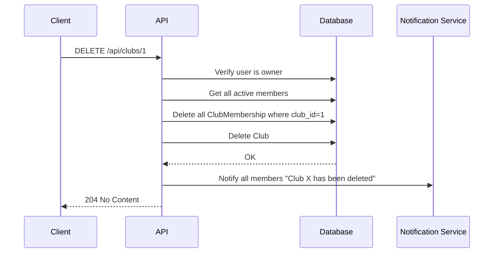

# 3. Club Management

| # | Endpoint | Method | Description |
|---|----------|--------|-------------|
| 3.1 | `/api/clubs` | POST | Create club |
| 3.2 | `/api/clubs/{club_id}` | GET | Get club details |
| 3.3 | `/api/clubs` | GET | List/search clubs |
| 3.4 | `/api/clubs/{club_id}` | PATCH | Update club |
| 3.5 | `/api/clubs/{club_id}/logo` | POST | Upload club logo |
| 3.6 | `/api/clubs/{club_id}/members` | GET | List club members |
| 3.7 | `/api/clubs/{club_id}` | DELETE | Delete club |

## 3.1 Create Club

**Endpoint:** `POST /api/clubs`

**Authorization:** Authenticated user

**Request:**
```json
{
  "name": "Moscow Orienteers",
  "description": "Orienteering club in Moscow",
  "privacy": "by_request",
  "location": "Moscow, Russia"
}
```

**Flow:**
1. Validate name uniqueness
2. Create Club with `owner_id=current_user`
3. Create ClubMembership with `role=owner`, `status=active`
4. Return club data

**Response:** `201 Created`
```json
{
  "id": 1,
  "name": "Moscow Orienteers",
  "description": "Orienteering club in Moscow",
  "logo": null,
  "location": "Moscow, Russia",
  "privacy": "by_request",
  "owner_id": 5,
  "members_count": 1,
  "created_at": "2024-01-15T10:00:00Z"
}
```

## 3.2 Get Club Details

**Endpoint:** `GET /api/clubs/{club_id}`

**Authorization:** Optional (authenticated for `membership_status` field)

**Response:** `200 OK`
```json
{
  "id": 1,
  "name": "Moscow Orienteers",
  "description": "Orienteering club in Moscow",
  "logo": "https://minio.../clubs/1.jpg",
  "location": "Moscow, Russia",
  "privacy": "by_request",
  "owner": {
    "id": 5,
    "username_display": "ivan_petrov",
    "first_name": "Ivan"
  },
  "members_count": 45,
  "membership_status": "active",
  "membership_role": "member",
  "created_at": "2024-01-15T10:00:00Z"
}
```

**`membership_status` values** (requires authentication, otherwise `null`):
| Value | Meaning | UI Element |
|-------|---------|------------|
| `null` | Not authenticated or not a member | "Join" button |
| `pending` | Request sent, awaiting approval | "Requested" (disabled) |
| `rejected` | Rejected (masked as pending) | "Requested" (disabled) |
| `active` | Current member | "Leave" button / member badge |

**`membership_role`:** Only included when `membership_status=active`. Values: `owner`, `admin`, `coach`, `member`.

## 3.3 List/Search Clubs

**Endpoint:** `GET /api/clubs`

**Authorization:** Optional

**Query params:**
- `q` — search query (matches name, description, location)
- `privacy` — filter by `public`, `private`, `by_request`
- `limit`, `offset` — pagination

**Response:** `200 OK`
```json
{
  "clubs": [
    {
      "id": 1,
      "name": "Moscow Orienteers",
      "logo": "https://minio.../clubs/1.jpg",
      "location": "Moscow, Russia",
      "privacy": "by_request",
      "members_count": 45,
      "membership_status": "active"
    }
  ],
  "total": 15,
  "limit": 20,
  "offset": 0
}
```

**Note:** Private clubs (`privacy=private`) are only visible to members.

## 3.4 Update Club

**Endpoint:** `PATCH /api/clubs/{club_id}`

**Authorization:** Owner or Coach

**Request:**
```json
{
  "name": "Moscow Orienteers Club",
  "description": "Updated description",
  "location": "Moscow, Russia",
  "privacy": "public"
}
```

**Updatable fields:** `name`, `description`, `location`, `privacy`

**Note:** Changing privacy from `public` to `private`/`by_request` does not affect existing members.

**Response:** `200 OK` (updated club object)

## 3.5 Upload Club Logo

**Endpoint:** `POST /api/clubs/{club_id}/logo`

**Authorization:** Owner or Coach

**Request:** `multipart/form-data`
```
file: <binary image>
```

**Flow:**
1. Verify user is owner or admin
2. Validate image (type: jpg/png, size < 5MB)
3. Resize/optimize
4. Upload to MinIO: `clubs/{club_id}.jpg`
5. Update club.logo

**Response:** `200 OK`
```json
{
  "logo": "https://minio.../clubs/1.jpg"
}
```

## 3.6 List Club Members

**Endpoint:** `GET /api/clubs/{club_id}/members`

**Authorization:** Optional (more details if authenticated member)

**Query params:**
- `role` — filter by `owner`, `admin`, `coach`, `member`
- `status` — filter by `active`, `pending` (pending only visible to owner/admin/coach)
- `limit`, `offset` — pagination

**Response:** `200 OK`
```json
{
  "members": [
    {
      "id": 1,
      "user": {
        "id": 5,
        "username_display": "ivan_petrov",
        "first_name": "Ivan",
        "last_name": "P.",
        "logo": "https://minio.../avatars/5.jpg"
      },
      "role": "owner",
      "status": "active",
      "joined_at": "2024-01-15T10:00:00Z"
    }
  ],
  "total": 45,
  "limit": 20,
  "offset": 0
}
```

**Visibility:**
| Viewer | Can see |
|--------|---------|
| Non-member | `active` members only |
| Member | `active` members |
| Owner/Coach | `active` + `pending` members |

## 3.7 Delete Club

**Endpoint:** `DELETE /api/clubs/{club_id}`

**Authorization:** Owner only

**Deletion type:** **Hard delete with cascade**

**Cascade behavior:**
| Related Entity | Action |
|----------------|--------|
| ClubMembership | **Cascade delete** all records |
| Members | **Notify** all active members: "Club X has been deleted" |

**Flow:**


**Response:** `204 No Content`

---

