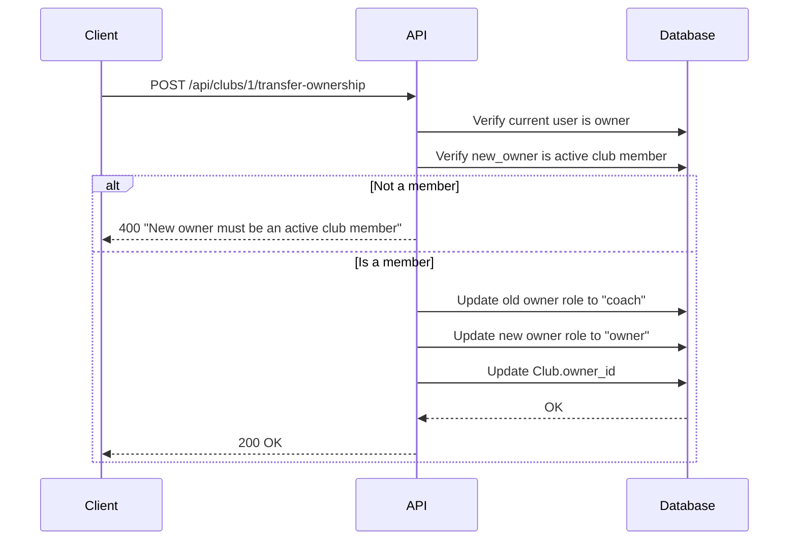

# 4. Club Membership

| # | Endpoint | Method | Description |
|---|----------|--------|-------------|
| 4.1 | `/api/clubs/{club_id}/join` | POST | Join club |
| 4.1b | `/api/clubs/{club_id}/members` | POST | Add member (admin) |
| 4.2 | `/api/clubs/{club_id}/members/{membership_id}` | PATCH | Approve/reject membership |
| 4.3 | `/api/clubs/{club_id}/members/me` | DELETE | Leave club |
| 4.4 | `/api/clubs/{club_id}/members/{user_id}` | DELETE | Remove member |
| 4.5 | `/api/clubs/{club_id}/members/{user_id}/role` | PATCH | Assign/remove role |
| 4.6 | `/api/clubs/{club_id}/transfer-ownership` | POST | Transfer ownership |

## 4.1 Join Club

**Endpoint:** `POST /api/clubs/{club_id}/join`

**Authorization:** Authenticated user

**Flow by privacy:**
| Club Privacy | Membership Status | Action |
|--------------|-------------------|--------|
| `public` | `active` | Instant join |
| `by_request` | `pending` | Request sent to owner/coach |

**Request:** (empty body)

**Response:** `201 Created`
```json
{
  "id": 1,
  "user_id": 5,
  "club_id": 10,
  "role": "member",
  "status": "pending",
  "created_at": "2024-01-15T10:00:00Z"
}
```

**Errors:**
- `400` - Already a member or previous request was rejected
- `404` - Club not found

## 4.1b Add Member (Admin)

**Endpoint:** `POST /api/clubs/{club_id}/members`

**Authorization:** Owner or Coach

**Purpose:** Add a user directly to the club. Useful for adding ghost users.

**Request:**
```json
{
  "user_id": 15,
  "role": "member"
}
```

**Role values:** `coach`, `member` (cannot set `owner` - use transfer ownership)

**Flow:**
1. Verify caller is owner or coach
2. Verify target user exists
3. Verify user is not already a member
4. Create membership with `status=active` (immediate join)

**Response:** `201 Created`
```json
{
  "id": 1,
  "user_id": 15,
  "club_id": 10,
  "role": "member",
  "status": "active",
  "joined_at": "2024-01-15T10:00:00Z",
  "created_at": "2024-01-15T10:00:00Z"
}
```

**Errors:**
- `400` - User already a member, or trying to set owner role
- `403` - Caller is not owner or coach
- `404` - Club or user not found

## 4.2 Approve/Reject Membership Request

**Endpoint:** `PATCH /api/clubs/{club_id}/members/{membership_id}`

**Authorization:** Owner or Coach

**Request:**
```json
{
  "status": "active"
}
```

**Status values:** `active`, `rejected`

**Flow:**
- If `active`: Set `joined_at=now()`, notify user "Your request to join X was approved"
- If `rejected`: Update status to `rejected` (soft delete — hidden from owner/coach, shown as `pending` to requester)

**Rejection behavior** (same as follow system):
| User | What they see |
|------|---------------|
| **Requester** | Status = `pending` (thinks still waiting) |
| **Owner/Coach** | Record hidden from pending list |

**Response:** `200 OK`

## 4.3 Leave Club

**Endpoint:** `DELETE /api/clubs/{club_id}/members/me`

**Authorization:** Current user (member)

**Deletion type:** **Hard delete**

**Restriction:** Owner cannot leave — must transfer ownership first.

**Flow:**
1. Check user is not owner
2. Delete ClubMembership record (regardless of status)
3. No notification

**Note:** Hard delete allows the user to send a new join request later.

**Response:** `204 No Content`

**Errors:**
- `400` - Owner cannot leave club

## 4.4 Remove Member from Club

**Endpoint:** `DELETE /api/clubs/{club_id}/members/{user_id}`

**Authorization:** Owner or Coach

**Permission matrix:**
| Actor | Can Remove |
|-------|------------|
| Owner | Coach, Member |
| Coach | Member |

**Deletion type:** **Hard delete**

**Flow:**
1. Verify actor has permission over target role
2. Delete ClubMembership record
3. Notify removed user "You have been removed from club X"

**Response:** `204 No Content`

**Errors:**
- `403` - Insufficient permissions (e.g., coach trying to remove another coach)

## 4.5 Assign/Remove Role

**Endpoint:** `PATCH /api/clubs/{club_id}/members/{user_id}/role`

**Authorization:** Owner only

**Request:**
```json
{
  "role": "coach"
}
```

**Role values:** `coach`, `member`

**Note:** Cannot change owner role — use transfer ownership (4.6).

**Flow:**
1. Verify current user is owner
2. Verify target is active member
3. Update role
4. Notify user "Your role in club X has been changed to coach"

**Response:** `200 OK`
```json
{
  "id": 1,
  "user_id": 15,
  "club_id": 10,
  "role": "coach",
  "status": "active",
  "joined_at": "2024-01-15T10:00:00Z"
}
```

## 4.6 Transfer Club Ownership

**Endpoint:** `POST /api/clubs/{club_id}/transfer-ownership`

**Authorization:** Owner only

**Request:**
```json
{
  "new_owner_id": 15
}
```

**Flow:**


**Note:** Old owner becomes coach (not removed from club).

**Response:** `200 OK`
```json
{
  "id": 1,
  "name": "Moscow Orienteers",
  "owner_id": 15,
  "message": "Ownership transferred successfully"
}
```

---

