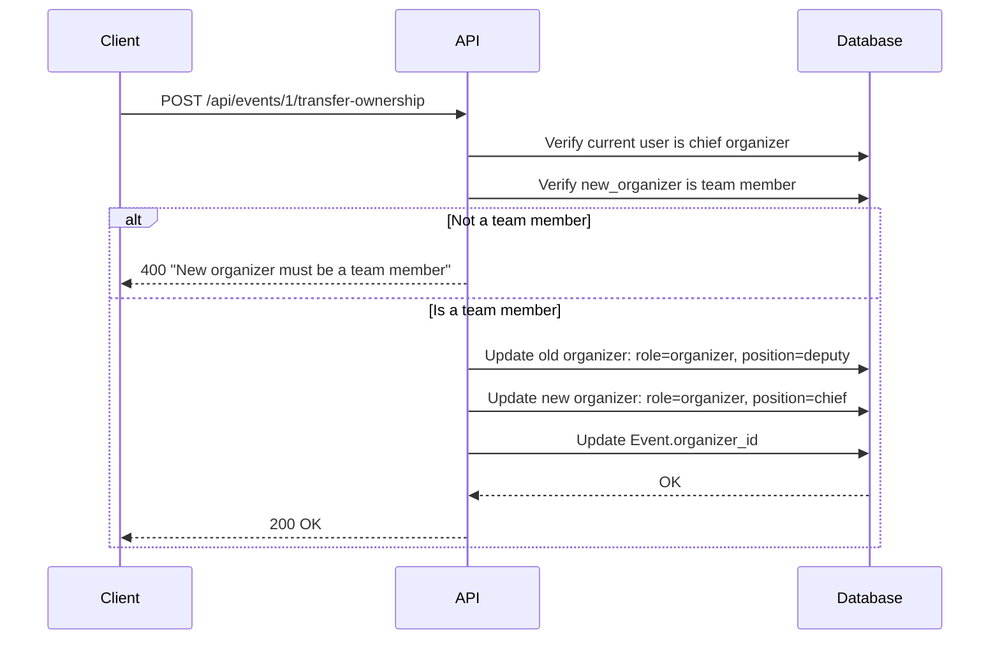

# 6. Event Management

| # | Endpoint | Method | Description |
|---|----------|--------|-------------|
| 6.1 | `/api/events` | POST | Create event |
| 6.2 | `/api/events/{event_id}` | GET | Get event details |
| 6.3 | `/api/events` | GET | List/search events |
| 6.4 | `/api/events/{event_id}` | PATCH | Update event |
| 6.5 | `/api/events/{event_id}` | DELETE | Delete event |
| 6.6 | `/api/events/{event_id}/logo` | POST | Upload event logo |
| 6.7 | `/api/events/{event_id}/team` | GET | List team members |
| 6.8 | `/api/events/{event_id}/team` | POST | Add team member |
| 6.9 | `/api/events/{event_id}/team/{user_id}` | PATCH | Update team member |
| 6.10 | `/api/events/{event_id}/team/{user_id}` | DELETE | Remove team member |
| 6.11 | `/api/events/{event_id}/transfer-ownership` | POST | Transfer organizer role |

## Event Concept

An **Event** is a container for one or more competitions, plus the organizational process:
- Registration management
- Athlete approval
- Competition execution
- Results publication

Events are organized by a **team** with different roles and hierarchy.

### Event Roles

| Role | Type | Has Position | Description |
|------|------|--------------|-------------|
| `organizer` | Team | Yes | Full control, manage team, delete event |
| `secretary` | Team | Yes | Manage registrations, approve athletes, upload results |
| `judge` | Team | Yes | View registrations, manage results, mark DSQ/DNF |
| `volunteer` | Team | No | View-only access to event data |
| `participant` | Athlete | No | Athletes competing in the event |
| `spectator` | Viewer | No | Viewers |

**Note:** This section covers team roles (organizer, secretary, judge, volunteer). Participant and spectator roles are managed in [07. Event Participation](./07-event-participation.md).

### Team Hierarchy

Each team role (except volunteer) can have a hierarchy:

| Position | Limit per role | Description |
|----------|----------------|-------------|
| `chief` | Max 1 | Chief of this role |
| `deputy` | Unlimited | Deputy chief |
| `null` | Unlimited | Regular member |

### Event Status Flow

```
draft ──┐
        ├──► planned ──► registration_open ──► in_progress ──► finished
        │                       │                   │
        │                       └───────────────────┴──► cancelled
        │
   (optional)
```

| Status | Description | Visible |
|--------|-------------|---------|
| `draft` | Event created, not visible to public | No |
| `planned` | Visible, registration not open yet (default) | Yes |
| `registration_open` | Athletes can register | Yes |
| `in_progress` | Event running | Yes |
| `finished` | Completed | Yes |
| `cancelled` | Cancelled | Yes |

---

## 6.1 Create Event

**Endpoint:** `POST /api/events`

**Authorization:** Authenticated user

**Request:**
```json
{
  "name": "Moscow Open 2024",
  "logo": null,
  "description": "Annual orienteering competition",
  "start_date": "2024-06-15",
  "end_date": "2024-06-16",
  "location": "Moscow Region",
  "sport_kind": "orient",
  "privacy": "public",
  "status": "planned",
  "max_participants": 500
}
```

**Flow:**
1. Create Event with `organizer_id=current_user`, `status=planned` (default)
2. Create EventParticipation with `role=organizer`, `position=chief`, `status=approved`
3. Return event data

**Note:** `status` can optionally be set to `draft` at creation. Default is `planned`.

**Response:** `201 Created`
```json
{
  "id": 1,
  "name": "Moscow Open 2024",
  "logo": null,
  "description": "Annual orienteering competition",
  "start_date": "2024-06-15",
  "end_date": "2024-06-16",
  "location": "Moscow Region",
  "sport_kind": "orient",
  "privacy": "public",
  "status": "planned",
  "max_participants": 500,
  "organizer_id": 5,
  "competitions_count": 0,
  "team_count": 1,
  "participants_count": 0,
  "created_at": "2024-01-15T10:00:00Z"
}
```

## 6.2 Get Event Details

**Endpoint:** `GET /api/events/{event_id}`

**Authorization:** Optional (authenticated for `my_role` field)

**Response:** `200 OK`
```json
{
  "id": 1,
  "name": "Moscow Open 2024",
  "logo": "http://minio:9000/event-logos/1/logo.jpg",
  "description": "Annual orienteering competition",
  "start_date": "2024-06-15",
  "end_date": "2024-06-16",
  "location": "Moscow Region",
  "sport_kind": "orient",
  "privacy": "public",
  "status": "registration_open",
  "max_participants": 500,
  "organizer": {
    "id": 5,
    "username_display": "ivan_petrov",
    "first_name": "Ivan"
  },
  "competitions_count": 3,
  "participants_count": 120,
  "team_count": 8,
  "my_role": "secretary",
  "my_position": "chief",
  "created_at": "2024-01-15T10:00:00Z"
}
```

**Visibility:**
| Status | Who can see |
|--------|-------------|
| `draft` | Team members only |
| Other statuses | Everyone (respecting `privacy` setting) |

**`my_role` / `my_position`:** Only included if current user is a participant (any role).

## 6.3 List/Search Events

**Endpoint:** `GET /api/events`

**Authorization:** Optional

**Query params:**
- `q` — search query (matches name, description, location)
- `sport_kind` — filter by sport
- `status` — filter by status
- `privacy` — filter by `public`, `by_request`
- `start_date_from`, `start_date_to` — date range
- `limit`, `offset` — pagination

**Response:** `200 OK`
```json
{
  "events": [
    {
      "id": 1,
      "name": "Moscow Open 2024",
      "logo": "http://minio:9000/event-logos/1/logo.jpg",
      "start_date": "2024-06-15",
      "end_date": "2024-06-16",
      "location": "Moscow Region",
      "sport_kind": "orient",
      "privacy": "public",
      "status": "registration_open",
      "competitions_count": 3,
      "participants_count": 120,
      "my_role": null
    }
  ],
  "total": 25,
  "limit": 20,
  "offset": 0
}
```

**Note:** Events with `status=draft` are excluded unless user is a team member.

## 6.4 Update Event

**Endpoint:** `PATCH /api/events/{event_id}`

**Authorization:** Organizer (chief or deputy) or Secretary (chief)

**Request:**
```json
{
  "name": "Moscow Open 2024 - Updated",
  "status": "registration_open"
}
```

**Updatable fields:** `name`, `logo`, `description`, `start_date`, `end_date`, `location`, `sport_kind`, `privacy`, `status`, `max_participants`

**Status transition rules:**
| From | Allowed To |
|------|------------|
| `draft` | `planned`, `cancelled` |
| `planned` | `draft`, `registration_open`, `cancelled` |
| `registration_open` | `planned`, `in_progress`, `cancelled` |
| `in_progress` | `finished`, `cancelled` |
| `finished` | — (terminal) |
| `cancelled` | — (terminal) |

**Response:** `200 OK` (updated event object)

## 6.5 Delete Event

**Endpoint:** `DELETE /api/events/{event_id}`

**Authorization:** Organizer (chief only)

**Deletion type:** **Hard delete with cascade**

**Restriction:** Cannot delete if `status=in_progress`

**Cascade behavior:**
| Related Entity | Action |
|----------------|--------|
| Competition | **Cascade delete** |
| CompetitionRegistration | **Cascade delete** (via Competition) |
| Result | **Cascade delete** (via Competition) |
| EventParticipation | **Cascade delete** |
| Artifact | **Cascade delete** (via Competition) + remove from MinIO |

**Flow:**
1. Check user is chief organizer
2. Check status is not `in_progress`
3. Notify all team members and participants: "Event X has been deleted"
4. Delete all related data
5. Return success

**Response:** `204 No Content`

**Errors:**
- `400` - Cannot delete event in progress
- `403` - Only chief organizer can delete

## 6.6 List Team Members

**Endpoint:** `GET /api/events/{event_id}/team`

**Authorization:** Optional (full details for team members)

**Query params:**
- `role` — filter by `organizer`, `secretary`, `judge`, `volunteer`
- `limit`, `offset` — pagination

**Note:** Returns only team roles (organizer, secretary, judge, volunteer). For participants and spectators, see [07. Event Participation](./07-event-participation.md).

**Response:** `200 OK`
```json
{
  "team": [
    {
      "id": 1,
      "user": {
        "id": 5,
        "username_display": "ivan_petrov",
        "first_name": "Ivan",
        "last_name": "P.",
        "logo": "https://minio.../avatars/5.jpg"
      },
      "role": "organizer",
      "position": "chief",
      "joined_at": "2024-01-15T10:00:00Z"
    },
    {
      "id": 2,
      "user": {
        "id": 10,
        "username_display": "maria_smith",
        "first_name": "Maria",
        "last_name": "S."
      },
      "role": "secretary",
      "position": "chief",
      "joined_at": "2024-01-16T10:00:00Z"
    }
  ],
  "total": 8,
  "limit": 20,
  "offset": 0
}
```

## 6.7 Add Team Member

**Endpoint:** `POST /api/events/{event_id}/team`

**Authorization:** Organizer (chief or deputy)

**Request:**
```json
{
  "user_id": 15,
  "role": "judge",
  "position": "chief"
}
```

**Flow:**
1. Verify current user is organizer (chief or deputy)
2. Verify target user exists
3. Check if `position=chief` and chief already exists for this role → error
4. Create EventParticipation with `status=approved`
5. Notify user: "You have been added to event X as judge"

**Response:** `201 Created`
```json
{
  "id": 5,
  "user_id": 15,
  "event_id": 1,
  "role": "judge",
  "position": "chief",
  "status": "approved",
  "joined_at": "2024-01-20T10:00:00Z"
}
```

**Errors:**
- `400` - Chief already exists for this role
- `400` - User is already a team member
- `400` - Invalid role (participant/spectator not allowed here)

## 6.8 Update Team Member

**Endpoint:** `PATCH /api/events/{event_id}/team/{user_id}`

**Authorization:** Organizer (chief or deputy)

**Request:**
```json
{
  "role": "secretary",
  "position": "deputy"
}
```

**Updatable fields:** `role`, `position`

**Constraints:**
- Cannot change organizer chief's role (must transfer ownership)
- Cannot set `position=chief` if chief already exists for target role
- Cannot change role to participant/spectator (use 07. Event Participation)

**Response:** `200 OK` (updated team member object)

## 6.9 Remove Team Member

**Endpoint:** `DELETE /api/events/{event_id}/team/{user_id}`

**Authorization:** Organizer (chief or deputy)

**Deletion type:** **Hard delete**

**Constraints:**
- Cannot remove organizer chief (must transfer ownership first)
- Cannot remove yourself

**Flow:**
1. Verify constraints
2. Delete EventParticipation record
3. Notify user: "You have been removed from event X"

**Response:** `204 No Content`

## 6.10 Transfer Organizer Role

**Endpoint:** `POST /api/events/{event_id}/transfer-ownership`

**Authorization:** Organizer (chief only)

**Request:**
```json
{
  "new_organizer_id": 15
}
```

**Flow:**


**Note:** Old organizer becomes deputy organizer (stays on team).

**Response:** `200 OK`
```json
{
  "id": 1,
  "name": "Moscow Open 2024",
  "organizer_id": 15,
  "message": "Ownership transferred successfully"
}
```

---

