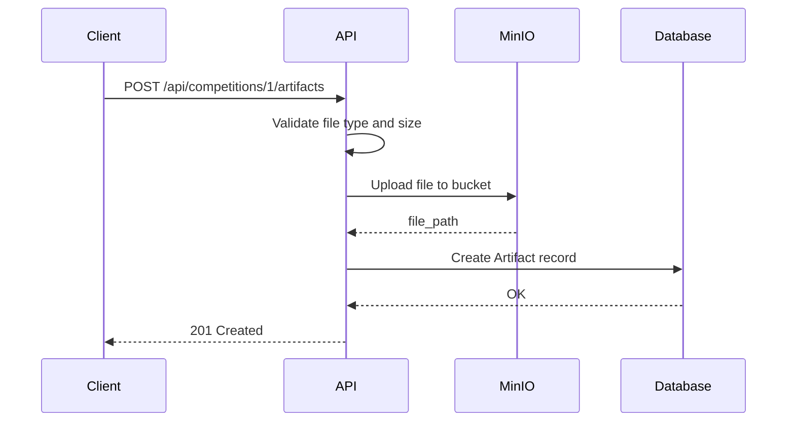

# 10. Artifact Management

| # | Endpoint | Method | Description |
|---|----------|--------|-------------|
| 10.1 | `/api/competitions/{competition_id}/artifacts` | POST | Upload competition artifact |
| 10.2 | `/api/competitions/{competition_id}/artifacts` | GET | List competition artifacts |
| 10.3 | `/api/artifacts/{artifact_id}` | GET | Get artifact details |
| 10.4 | `/api/artifacts/{artifact_id}` | PATCH | Update artifact |
| 10.5 | `/api/artifacts/{artifact_id}` | DELETE | Delete artifact |
| 10.6 | `/api/artifacts/{artifact_id}/download` | GET | Download artifact file |
| 10.7 | `/api/workouts/{workout_id}/artifacts` | POST | Upload workout artifact |
| 10.8 | `/api/workouts/{workout_id}/artifacts` | GET | List workout artifacts |

## Artifact Concept

An **Artifact** is a file attached to either a competition (by organizer) or a workout (by user).

### Artifact Kinds

**Competition artifacts** (uploaded by organizer):
| Kind | Description |
|------|-------------|
| `map` | Orienteering map image |
| `course` | Course file (OCAD, Purple Pen) |
| `results_file` | Results export file |
| `photo` | Event photos |

**Workout artifacts** (uploaded by user):
| Kind | Description |
|------|-------------|
| `gps_track` | GPS track file (GPX) |
| `fit_file` | Garmin FIT file |
| `tcx_file` | TCX file |

### Linking to Competition

| Artifact type | Link to competition |
|---------------|---------------------|
| Competition artifact | Direct via `competition_id` |
| Workout artifact | Through `Workout → Result → Competition` |

### Visibility

| Artifact type | Visibility |
|---------------|------------|
| Competition artifact | Public |
| Workout artifact | Follows user's `privacy_default` |

---

## 10.1 Upload Competition Artifact

**Endpoint:** `POST /api/competitions/{competition_id}/artifacts`

**Authorization:** Organizer or Secretary

**Request:** `multipart/form-data`
```
file: <binary>
kind: "map"
tags: "sprint,urban"
```

**Flow:**


**File path pattern:** `events/{event_id}/{competition_id}/{kind}/{filename}`

**File validation:**
| Kind | Allowed extensions | Max size |
|------|-------------------|----------|
| `map` | jpg, png, pdf | 50 MB |
| `course` | ocd, xml, ppn | 10 MB |
| `results_file` | csv, xml, json | 5 MB |
| `photo` | jpg, png | 20 MB |

**Response:** `201 Created`
```json
{
  "id": 1,
  "competition_id": 1,
  "workout_id": null,
  "user_id": 5,
  "kind": "map",
  "file_path": "events/1/1/map/course_m21.jpg",
  "file_name": "course_m21.jpg",
  "file_size": 2048576,
  "mime_type": "image/jpeg",
  "tags": ["sprint", "urban"],
  "created_at": "2024-01-20T10:00:00Z"
}
```

**Errors:**
- `400` - Invalid file type for kind
- `400` - File too large
- `403` - Insufficient permissions

## 10.2 List Competition Artifacts

**Endpoint:** `GET /api/competitions/{competition_id}/artifacts`

**Authorization:** Public

**Query params:**
- `kind` — filter by kind (`map`, `course`, `results_file`, `photo`)
- `tags` — filter by tags (comma-separated)
- `limit`, `offset` — pagination

**Response:** `200 OK`
```json
{
  "artifacts": [
    {
      "id": 1,
      "kind": "map",
      "file_name": "course_m21.jpg",
      "file_size": 2048576,
      "mime_type": "image/jpeg",
      "tags": ["sprint", "urban"],
      "uploaded_by": {
        "id": 5,
        "username_display": "ivan_petrov"
      },
      "created_at": "2024-01-20T10:00:00Z"
    }
  ],
  "total": 5,
  "limit": 20,
  "offset": 0
}
```

## 10.3 Get Artifact Details

**Endpoint:** `GET /api/artifacts/{artifact_id}`

**Authorization:**
- Competition artifact: Public
- Workout artifact: Follows user's privacy

**Response:** `200 OK`
```json
{
  "id": 1,
  "competition_id": 1,
  "workout_id": null,
  "kind": "map",
  "file_path": "events/1/1/map/course_m21.jpg",
  "file_name": "course_m21.jpg",
  "file_size": 2048576,
  "mime_type": "image/jpeg",
  "tags": ["sprint", "urban"],
  "uploaded_by": {
    "id": 5,
    "username_display": "ivan_petrov"
  },
  "download_url": "https://minio.../events/1/1/map/course_m21.jpg?token=...",
  "created_at": "2024-01-20T10:00:00Z"
}
```

**Errors:**
- `403` - Private workout artifact, not authorized
- `404` - Artifact not found

## 10.4 Update Artifact

**Endpoint:** `PATCH /api/artifacts/{artifact_id}`

**Authorization:**
- Competition artifact: Organizer, Secretary, or uploader
- Workout artifact: Owner only

**Request:**
```json
{
  "tags": ["sprint", "forest", "night"],
  "kind": "photo"
}
```

**Updatable fields:** `tags`, `kind`

**Note:** Cannot update file — delete and re-upload instead.

**Response:** `200 OK` (updated artifact object)

**Errors:**
- `400` - Invalid kind for artifact type
- `403` - Insufficient permissions

## 10.5 Delete Artifact

**Endpoint:** `DELETE /api/artifacts/{artifact_id}`

**Authorization:**
- Competition artifact: Organizer, Secretary, or uploader
- Workout artifact: Owner only

**Deletion type:** **Hard delete**

**Flow:**
1. Delete file from MinIO
2. Delete Artifact record

**Response:** `204 No Content`

**Errors:**
- `403` - Insufficient permissions
- `404` - Artifact not found

## 10.6 Download Artifact File

**Endpoint:** `GET /api/artifacts/{artifact_id}/download`

**Authorization:**
- Competition artifact: Public
- Workout artifact: Follows user's privacy

**Response:** `302 Redirect` to MinIO pre-signed URL

**Alternative response:** `200 OK` with binary file stream

**Errors:**
- `403` - Private workout artifact, not authorized
- `404` - Artifact not found

## 10.7 Upload Workout Artifact

**Endpoint:** `POST /api/workouts/{workout_id}/artifacts`

**Authorization:** Workout owner only

**Request:** `multipart/form-data`
```
file: <binary>
kind: "gps_track"
tags: "training,interval"
```

**File path pattern:** `users/{user_id}/workouts/{workout_id}/{kind}/{filename}`

**File validation:**
| Kind | Allowed extensions | Max size |
|------|-------------------|----------|
| `gps_track` | gpx | 10 MB |
| `fit_file` | fit | 20 MB |
| `tcx_file` | tcx | 10 MB |

**Response:** `201 Created`
```json
{
  "id": 10,
  "competition_id": null,
  "workout_id": 5,
  "user_id": 15,
  "kind": "gps_track",
  "file_path": "users/15/workouts/5/gps_track/activity.gpx",
  "file_name": "activity.gpx",
  "file_size": 524288,
  "mime_type": "application/gpx+xml",
  "tags": ["training", "interval"],
  "created_at": "2024-01-20T10:00:00Z"
}
```

**Errors:**
- `400` - Invalid file type for kind
- `400` - File too large
- `403` - Not workout owner

## 10.8 List Workout Artifacts

**Endpoint:** `GET /api/workouts/{workout_id}/artifacts`

**Authorization:** Follows user's privacy

**Query params:**
- `kind` — filter by kind (`gps_track`, `fit_file`, `tcx_file`)
- `limit`, `offset` — pagination

**Response:** `200 OK`
```json
{
  "artifacts": [
    {
      "id": 10,
      "kind": "gps_track",
      "file_name": "activity.gpx",
      "file_size": 524288,
      "mime_type": "application/gpx+xml",
      "tags": ["training", "interval"],
      "created_at": "2024-01-20T10:00:00Z"
    }
  ],
  "total": 2,
  "limit": 20,
  "offset": 0
}
```

**Errors:**
- `403` - Private workout, not authorized
- `404` - Workout not found

---

## Updated Entity: Artifact

| # | Attribute | Type | Required | Description |
|---|-----------|------|----------|-------------|
| 1 | `id` | int | PK | |
| 2 | `competition_id` | int | FK → Competition, nullable | For competition artifacts |
| 3 | `workout_id` | int | FK → Workout, nullable | For workout artifacts |
| 4 | `user_id` | int | FK → User | Uploader |
| 5 | `kind` | enum | yes | Artifact kind |
| 6 | `file_path` | string | yes | Path in MinIO |
| 7 | `file_name` | string | yes | Original filename |
| 8 | `file_size` | int | yes | Size in bytes |
| 9 | `mime_type` | string | yes | MIME type |
| 10 | `tags` | array | no | Tags for filtering |
| 11 | `created_at` | datetime | yes | |

**Constraint:** Either `competition_id` OR `workout_id` must be set (mutually exclusive, not both null).

---
