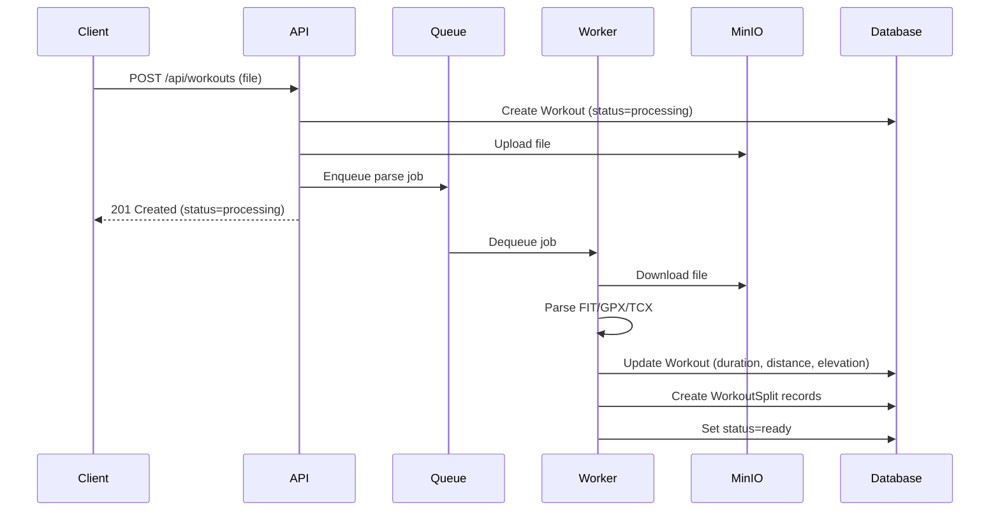

# 12. Workout Management

| # | Endpoint | Method | Description |
|---|----------|--------|-------------|
| 12.1 | `/api/workouts` | POST | Create workout |
| 12.2 | `/api/workouts` | GET | List my workouts |
| 12.3 | `/api/workouts/{workout_id}` | GET | Get workout details |
| 12.4 | `/api/users/{user_id}/workouts` | GET | List user's workouts |
| 12.5 | `/api/workouts/{workout_id}` | PATCH | Update workout |
| 12.6 | `/api/workouts/{workout_id}` | DELETE | Delete workout |

## Workout Concept

A **Workout** is a training session or activity recorded by a user, typically from a GPS device file (FIT, GPX, TCX).

### Workout Status

| Status | Description |
|--------|-------------|
| `draft` | Being recorded (manual entry) |
| `processing` | File uploaded, parsing in progress |
| `ready` | Parsed and available |
| `error` | Failed to parse file |

### Linking to Competition

Workouts can be linked to competition results via **Result.workout_id** (see [11.9 Link Workout to Result](./11-result-management.md#119-link-workout-to-result)).

```
Workout → Result → Competition
```

---

## 12.1 Create Workout

**Endpoint:** `POST /api/workouts`

**Authorization:** Authenticated user

**Request:** `multipart/form-data`
```
file: <binary>  // FIT, GPX, or TCX (optional)
title: "Morning training"
sport_kind: "orient"
privacy: "followers"
description: "Interval session in the park"
```

**Flow (with file):**


**Flow (without file — manual entry):**
1. Create Workout with `status=draft`
2. User can manually add WorkoutSplits via [13.2](./13-split-management.md#132-manual-split-entry)

**Response:** `201 Created`
```json
{
  "id": 5,
  "user_id": 15,
  "title": "Morning training",
  "description": "Interval session in the park",
  "sport_kind": "orient",
  "privacy": "followers",
  "status": "processing",
  "start_datetime": null,
  "finish_datetime": null,
  "duration_ms": null,
  "distance_meters": null,
  "elevation_gain": null,
  "has_splits": false,
  "artifacts_count": 0,
  "created_at": "2024-01-20T10:00:00Z"
}
```

**Errors:**
- `400` - Invalid file format (not FIT/GPX/TCX)
- `400` - File too large (max 50MB)

## 12.2 List My Workouts

**Endpoint:** `GET /api/workouts`

**Authorization:** Authenticated user

**Query params:**
- `sport_kind` — filter by sport
- `status` — filter by status
- `date_from`, `date_to` — date range
- `sort_by` — `start_datetime` (default), `created_at`, `distance_meters`
- `order` — `desc` (default), `asc`
- `limit`, `offset` — pagination

**Response:** `200 OK`
```json
{
  "workouts": [
    {
      "id": 5,
      "title": "Morning training",
      "sport_kind": "orient",
      "privacy": "followers",
      "status": "ready",
      "start_datetime": "2024-01-20T07:30:00Z",
      "duration_ms": 3600000,
      "distance_meters": 8500,
      "elevation_gain": 120,
      "has_splits": true,
      "linked_result": {
        "id": 10,
        "competition_id": 1,
        "competition_name": "Day 1 - Long Distance"
      },
      "created_at": "2024-01-20T10:00:00Z"
    }
  ],
  "total": 45,
  "limit": 20,
  "offset": 0
}
```

## 12.3 Get Workout Details

**Endpoint:** `GET /api/workouts/{workout_id}`

**Authorization:** Follows workout privacy

**Response:** `200 OK`
```json
{
  "id": 5,
  "user": {
    "id": 15,
    "username_display": "ivan_petrov",
    "first_name": "Ivan",
    "last_name": "P."
  },
  "title": "Morning training",
  "description": "Interval session in the park",
  "sport_kind": "orient",
  "privacy": "followers",
  "status": "ready",
  "start_datetime": "2024-01-20T07:30:00Z",
  "finish_datetime": "2024-01-20T08:30:00Z",
  "duration_ms": 3600000,
  "distance_meters": 8500,
  "elevation_gain": 120,
  "splits": [
    {
      "id": 1,
      "sequence": 1,
      "control_point": "31",
      "distance_meters": 1200,
      "cumulative_time": 420000,
      "split_time": 420000
    },
    {
      "id": 2,
      "sequence": 2,
      "control_point": "45",
      "distance_meters": 2400,
      "cumulative_time": 850000,
      "split_time": 430000
    }
  ],
  "artifacts": [
    {
      "id": 10,
      "kind": "gps_track",
      "file_name": "activity.gpx"
    }
  ],
  "linked_result": {
    "id": 10,
    "competition_id": 1,
    "competition_name": "Day 1 - Long Distance",
    "position": 3,
    "time_total": 3845000
  },
  "created_at": "2024-01-20T10:00:00Z"
}
```

**Errors:**
- `403` - Private workout, not authorized
- `404` - Workout not found

## 12.4 List User's Workouts

**Endpoint:** `GET /api/users/{user_id}/workouts`

**Authorization:** Follows user's privacy settings

**Query params:**
- `sport_kind` — filter by sport
- `date_from`, `date_to` — date range
- `sort_by` — `start_datetime` (default), `created_at`
- `order` — `desc` (default), `asc`
- `limit`, `offset` — pagination

**Visibility:**
| User's privacy_default | Who can see |
|------------------------|-------------|
| `public` | Everyone |
| `followers` | Followers only |
| `private` | Owner only |

**Note:** Individual workout privacy overrides user default.

**Response:** `200 OK`
```json
{
  "user": {
    "id": 15,
    "username_display": "ivan_petrov",
    "first_name": "Ivan"
  },
  "workouts": [
    {
      "id": 5,
      "title": "Morning training",
      "sport_kind": "orient",
      "status": "ready",
      "start_datetime": "2024-01-20T07:30:00Z",
      "duration_ms": 3600000,
      "distance_meters": 8500,
      "has_splits": true,
      "created_at": "2024-01-20T10:00:00Z"
    }
  ],
  "total": 30,
  "limit": 20,
  "offset": 0
}
```

## 12.5 Update Workout

**Endpoint:** `PATCH /api/workouts/{workout_id}`

**Authorization:** Owner only

**Request:**
```json
{
  "title": "Updated title",
  "description": "New description",
  "privacy": "public",
  "sport_kind": "run"
}
```

**Updatable fields:** `title`, `description`, `privacy`, `sport_kind`

**Note:** Cannot update computed fields (`duration_ms`, `distance_meters`, `elevation_gain`, etc.) or replace file.

**Response:** `200 OK` (updated workout object)

## 12.6 Delete Workout

**Endpoint:** `DELETE /api/workouts/{workout_id}`

**Authorization:** Owner only

**Deletion type:** **Hard delete with cascade**

**Cascade behavior:**
| Related Entity | Action |
|----------------|--------|
| WorkoutSplit | **Cascade delete** |
| Artifact (workout) | **Cascade delete** + remove files from MinIO |
| Result.workout_id | **Set null** |

**Flow:**
1. Delete all WorkoutSplit records
2. Delete all Artifact records + files from MinIO
3. Set `workout_id=null` in Results referencing this workout
4. Delete original file from MinIO
5. Delete Workout record

**Response:** `204 No Content`

---

## Time Units

**All time fields use milliseconds (integer).**

| Field | Unit | Example |
|-------|------|---------|
| `duration_ms` | ms | `3600000` = 1 hour |
| `cumulative_time` (splits) | ms | `420000` = 7m 0s |
| `split_time` (splits) | ms | `430000` = 7m 10s |
| `time_total` (linked result) | ms | `3845000` = ~64m 5s |

### Why milliseconds?

- FIT files (Garmin, Polar, etc.) natively use milliseconds for timestamps and durations
- Supports sub-second precision for sprint events and fast sports
- Single consistent unit across all time fields in the API

### Frontend: displaying duration

```js
// ms → "HH:MM:SS" or "MM:SS"
function formatDuration(ms) {
  const totalSec = Math.floor(ms / 1000);
  const h = Math.floor(totalSec / 3600);
  const m = Math.floor((totalSec % 3600) / 60);
  const s = totalSec % 60;
  if (h > 0) return `${h}:${String(m).padStart(2,'0')}:${String(s).padStart(2,'0')}`;
  return `${m}:${String(s).padStart(2,'0')}`;
}
// 3600000 → "1:00:00"
// 420000  → "7:00"
```

### Frontend: sending duration

```js
// "HH:MM:SS" or "MM:SS" → ms
function parseDurationToMs(str) {
  const parts = str.trim().split(':').map(Number);
  if (parts.length === 2) return (parts[0] * 60 + parts[1]) * 1000;
  if (parts.length === 3) return (parts[0] * 3600 + parts[1] * 60 + parts[2]) * 1000;
  throw new Error('Invalid duration format');
}
```

---
